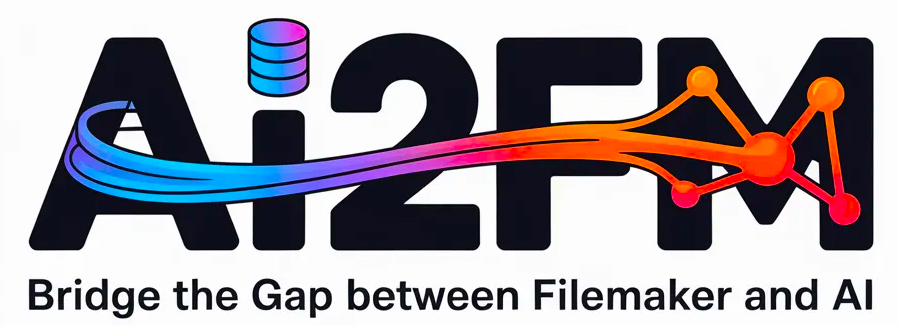

# ai2fm — Low-Latency Vibe Coding for FileMaker 🚀

## ai2fm-community
Welcome to the official community and issue tracker for **ai2fm**! 

[ai2fm](https://ai2fm.com/) is a VS Code extension that bridges the gap between FileMaker's strict XML clipboard format and modern AI code generation. It turns any VS Code-compatible editor into a full FileMaker IDE and provides a lossless, bidirectional translation pipeline so you can easily refactor, document, and extend your FileMaker scripts using plain text and AI agents (Claude, Codex, Gemini, Copilot, Local LLMs).

---

## 🐞 Bug Reports & Feature Requests

While the core translation engine is proprietary, **this repository serves as our public community hub**. 

If you run into an edge case, a dropped variable, or a compilation error, we want to know so we can patch it immediately.

* **Found a Bug?** [Open a Bug Report](../../issues/new?template=bug_report.yml) and include your failing `.fmscript` or XML snippet.
* **Have an Idea?** [Submit a Feature Request](../../issues/new?template=feature_request.yml) for new IDE enhancements, autocomplete templates, or script step additions.

---

## ⚡ The Workflow (Vibe Coding)

Turn hours of manual XML reconstruction into seconds. Because scripts live as text files in your IDE, AI agents see the whole relationship graph at once, and your scripts become Git-versionable.

1.  **Copy from FileMaker:** Select script steps in FileMaker and copy.
2.  **Translate (Ctrl+Alt+T):** In your IDE, translate the clipboard XML into readable `.fmscript` text.
3.  **Ask the AI:** Let your preferred AI agent refactor or extend the script in plain text.
4.  **Paste Back (Ctrl+Alt+F):** Rebuild the FileMaker-native XML on your clipboard and paste it straight back into the Script Workspace.

---

## 🛠️ Features

`ai2fm` operates on two layers: a free local IDE extension and a licensed server-side XSLT pipeline.

### Free — Full FileMaker IDE (Local)
Turns any VS Code fork (Cursor, Windsurf, Antigravity, Kiro, VSCodium) into a native FileMaker environment.
* **Autocomplete & Autoformat:** Native support for `.fmscript`, including instant `If` and `Loop` templates.
* **Live Validation:** Squiggles and Problems-panel updates as you type to prevent broken XML pastes.
* **Hover Docs:** Step documentation directly from the local FileMaker KB.
* **Clipboard I/O:** Copy XML from the editor to the FM clipboard (XMSS, XMFN, XMFD, XMTB, XMLO) or read the FM clipboard into the editor.

### Licensed — XSLT Transform Pipeline (Server-Side)
The engine that powers the seamless round trip.
* **Bidirectional Translation:** FM → Text and Text → FM.
* **Complete Coverage:** Supports all 214+ FileMaker script steps.
* **AI Guardrails:** Hallucination detection and multi-line step handling via a bracket-depth parser.
* **Localization:** Auto-translates script step labels to your local FileMaker install language on paste-back.
* **Safe Degradation:** Missing TO, field, and sub-script references are safely commented out—nothing is silently lost.

---

## ⌨️ Quick Shortcuts

| Shortcut | Action | Tier |
| :--- | :--- | :--- |
| **`Ctrl+Alt+G`** | Read FM clipboard into editor (raw XML) | Free |
| **`Ctrl+Alt+V`** | Copy editor XML as XMSS to FM clipboard | Free |
| **`Ctrl+Alt+T`** | **FM → Text:** clipboard XML to readable script | Licensed |
| **`Ctrl+Alt+F`** | **Text → FM:** validate text, rebuild FM clipboard | Licensed |

*(On macOS, substitute `Cmd` for `Ctrl` where your IDE binds it that way).*

---

## 🔒 Privacy-First Architecture

Your proprietary business logic never stays on our servers. 

The XSLT transform runs server-side, but payloads move over TLS, are processed entirely in volatile memory, and are **discarded the instant the response is sent.** * No disk writes.
* No logs of script content.
* No AI training on customer code—ever. 

---

## 📥 Installation

1. Download the latest `.vsix` extension file from [ai2fm.com](https://ai2fm.com/).
2. Open your preferred editor (VS Code, Cursor, Windsurf, etc.).
3. Press `Ctrl+Shift+P` (`Cmd+Shift+P` on Mac) and run: **`Extensions: Install from VSIX…`**
4. Select the unzipped `fm-clipboard-2.xx.0.vsix` file.
5. Run **`FM Clipboard: Enter License Key`** to activate your 21-day Free or Professional seat.

---

**Built by developers, for developers.** © 2026 Dimitris Kokoutsidis / [axelar.eu](https://axelar.eu) | [Contact Support](mailto:support@ai2fm.com)
